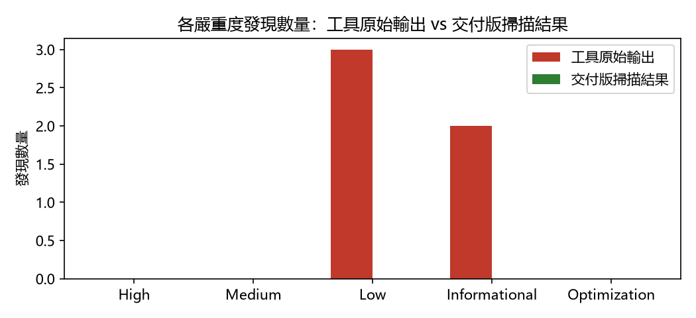

# 智能合約安全檢測報告

**檢測工具**: Slither
**檢測日期**: 2026-07-14T12:42:40.677595

---

## 1. 摘要結論

**本案資安等級：第二級**（各等級之定義與判定條件見「附錄二：發現分類與資安等級評定標準」）

無高風險項目及待處理事項，但有 2 項已知風險經工程團隊評估為可接受風險（分類為 B），詳見「完整分類明細」。

掃描工具原始輸出共 5 項；交付版掃描結果為 0 項（此為甲方以相同工具版本重新掃描交付程式碼時可重現的數字，兩者差異之逐筆理由見「完整分類明細」）。另有 1 筆由人工複核提出、非掃描工具產出的發現（見「人工複核發現」章節）。

---

## 2. 檢測方法與範圍限制

本報告由 Slither 靜態分析工具掃描產生，並經工程團隊逐筆人工分類複核。解讀本報告時，請留意以下範圍限制：

- **偵測範圍**：靜態分析擅長偵測「程式寫法特徵層級」的問題（如重入模式、`tx.origin` 授權、弱亂數來源、未檢查的低階呼叫回傳值等）。
- **已知偵測邊界**：業務邏輯層級的問題 —— 例如權限檢查的實作邏輯錯誤、應存在而未實作的保護、經濟模型層面的攻擊（搶跑、滑點）—— 不在靜態分析工具的可偵測範圍內。本報告的「人工複核發現」章節記錄工程團隊在分類複核過程中以人工方式補充發現的此類問題，但人工複核的覆蓋程度不等同於系統性審計。
- **文件性質**：本報告為交付前之**自我檢查證明**，證明工程團隊已執行掃描並對每一筆發現完成逐筆判讀；其不構成、亦不取代由獨立第三方執行之完整安全審計。

---

## 3. 掃描環境資訊

| 項目 | 內容 |
|---|---|
| 掃描時間 | 2026-07-14T12:42:40.677595 |
| 專案路徑 | /home/kai/security-scan-kit/test-fixtures/timelock-vault |
| Git commit | 4eeef1e077b74137cc280cec07123b9a7a2a1ad0 |
| Solidity / solc 版本 | unknown |
| Slither 版本 | 0.11.5 |
| Foundry (forge) 版本 | forge Version: 1.3.5-stable |

---

## 4. 摘要統計

「工具原始輸出」為 Slither 掃描的未經處理結果；「交付版掃描結果」為對含抑制註解之交付版程式碼重新掃描的結果 —— **亦即甲方使用相同版本 Slither（見「掃描環境資訊」）對交付程式碼自行掃描時，可重現的數字**。兩者的差異全部來自經人工分類為 B（可接受風險）或 C（誤報）並加上抑制註解的項目，逐筆理由與註解位置見「完整分類明細」。

嚴重程度沿用掃描工具原文的五個等級：High、Medium、Low、Informational、Optimization。

| 嚴重程度 | 工具原始輸出 | 交付版掃描結果 | 差異 |
|---|---|---|---|
| High | 0 | 0 | +0 |
| Medium | 0 | 0 | +0 |
| Low | 3 | 0 | -3 |
| Informational | 2 | 0 | -2 |
| Optimization | 0 | 0 | +0 |
| **總計** | **5** | **0** | **-5** |

---

## 5. 掃描結果對照圖表

---

## 6. 人工複核發現

以下項目由工程團隊在逐筆分類複核過程中以人工方式發現，**不在掃描工具的輸出之列**（多屬靜態分析無法偵測的邏輯層級問題，見「檢測方法與範圍限制」）。各筆開頭的「編號 M1、M2…」為人工複核發現之流水號：

- **編號 M1｜deposit() 每次加碼會重置整筆餘額的鎖倉期**（嚴重度：Low／分類 B）— src/TimelockVault.sol:38-43
  - 說明：unlockAt[msg.sender] 在每次 deposit() 時整筆覆寫為 block.timestamp + LOCK_PERIOD（L41），代表使用者加碼 1 wei 就會把既有全部餘額重新鎖 7 天。若前端或第三方合約代使用者存入，可能造成非預期的延長鎖倉。
  - 備註（已加上抑制註解）：與產品方確認過這是刻意設計（「任何異動重新起算定存期」），且已寫入使用者文件；技術上若要改為分批鎖倉需要 per-deposit 的紀錄結構，成本與收益不成比例。評估為可接受風險，於文件揭露。

---

## 7. 完整分類明細

以下依處置分類逐筆列出本次掃描的全部發現。各筆開頭的「編號 N」為掃描發現之流水號（依掃描輸出順序編定，與「附錄一：待人工確認清單」的編號一致，便於對照）；無該類項目時以「—」表示。

### A. 已確認漏洞，需修復

—

### B. 已知風險但可接受

- **編號 3｜timestamp**（嚴重度：Low）— src/TimelockVault.sol:46-57
  - 原始描述：TimelockVault.withdraw() (src/TimelockVault.sol#46-57) uses timestamp for comparisons Dangerous comparisons: - require(bool,string)(block.timestamp >= unlockAt[msg.sender],still locked) (src/TimelockVault.sol#49)
  - 備註（已加上抑制註解）：鎖倉判斷確實依賴 block.timestamp，出塊者可在共識容忍範圍內（秒級）微調時間戳，理論上能讓提款提早數秒解鎖。但 LOCK_PERIOD 為 7 天，秒級誤差對業務無實質影響，且合約內沒有以 timestamp 作為隨機性或計價來源的用法。評估為可接受風險，保留現狀。

### C. 可直接忽略（誤報）

- **編號 1｜reentrancy-events**（嚴重度：Low）— src/TimelockVault.sol:46-57
  - 原始描述：Reentrancy in TimelockVault.withdraw() (src/TimelockVault.sol#46-57): External calls: - (ok,None) = msg.sender.call{value: payout}() (src/TimelockVault.sol#54) Event emitted after the call(s): - Withdrawn(msg.sender,payout,fee) (src/TimelockVault.sol#56)
  - 備註（已加上抑制註解）：withdraw() 遵循 checks-effects-interactions：balances[msg.sender] 與 accruedFees 皆在外部呼叫前完成更新（L51-53），重入時餘額已歸零、require(amount > 0) 會擋下。工具指出的只是 Withdrawn 事件在外部呼叫之後才發出，僅影響鏈下索引器看到的事件順序，無資金風險。

- **編號 2｜reentrancy-events**（嚴重度：Low）— src/TimelockVault.sol:66-74
  - 原始描述：Reentrancy in TimelockVault.sweepFees(address) (src/TimelockVault.sol#66-74): External calls: - (ok,None) = to.call{value: amount}() (src/TimelockVault.sol#71) Event emitted after the call(s): - FeesSwept(to,amount) (src/TimelockVault.sol#73)
  - 備註（已加上抑制註解）：sweepFees() 同樣先把 accruedFees 歸零（L70）才做外部呼叫，且有 onlyOwner 保護（已檢查 modifier 實作：require(msg.sender == owner)，owner 為 immutable、建構時設定，邏輯有效）。工具指出的僅是 FeesSwept 事件順序問題，無資金風險。

- **編號 4｜low-level-calls**（嚴重度：Informational）— src/TimelockVault.sol:46-57
  - 原始描述：Low level call in TimelockVault.withdraw() (src/TimelockVault.sol#46-57): - (ok,None) = msg.sender.call{value: payout}() (src/TimelockVault.sol#54)
  - 備註（已加上抑制註解）：刻意選用 call{value:} 而非 transfer/send：後兩者的 2300 gas 上限在收款方是合約（多簽、智能錢包）時會失敗，call 是 Istanbul 之後的建議寫法。回傳值有 require(ok) 檢查，非未檢查的低階呼叫。

- **編號 5｜low-level-calls**（嚴重度：Informational）— src/TimelockVault.sol:66-74
  - 原始描述：Low level call in TimelockVault.sweepFees(address) (src/TimelockVault.sol#66-74): - (ok,None) = to.call{value: amount}() (src/TimelockVault.sol#71)
  - 備註（已加上抑制註解）：同 #4：call{value:} 為建議寫法（國庫地址可能是多簽合約），回傳值有 require(ok) 檢查。

### D. 待人工確認

—

---

## 附錄一：待人工確認清單

本次沒有待人工確認的項目 —— 所有掃描發現皆已分類為 A（已確認需修復）、B（可接受風險）或 C（誤報）並附上理由。

---

## 附錄二：發現分類與資安等級評定標準

本報告的判讀採兩層標準：先對每一筆發現進行**處置分類**（A／B／C／D），再由全部分類結果推導**整案資安等級**（第一級～第四級）。兩者為獨立系統，字母與級數不可互相對照。

**發現處置分類（逐筆判定）**

- **A｜已確認漏洞，需修復**：確認為真實問題（多涉及資金流向或權限控制邏輯），必須修復；不得以註解抑制，抑制等同隱匿。
- **B｜已知風險但可接受**：問題確實存在，但經工程團隊評估風險可控（例如僅管理者可呼叫、另有其他層級防護），附具體理由後可加註解抑制，並於報告揭露。
- **C｜可直接忽略（誤報）**：靜態分析限制造成的誤判，實際已有防護機制；附具體理由後可加註解抑制。
- **D｜待人工確認**：尚無法判定歸屬者一律列此類，不得抑制；判讀信心不足時寧列 D，不猜測分類。
- **人工複核發現**：掃描工具輸出之外、由人工閱讀原始碼發現的問題，僅得分類 A／B／D；經確認非問題者直接自清單移除，不設誤報分類。

**整案資安等級（以下由第一級至第四級列出定義；實際評定則由高至低逐條檢查，符合任一條件即定為該級）**

- **第一級｜可直接交付**：掃描範圍內所有發現均確認為誤報，且無待處理之人工複核發現。
- **第二級｜可交付，需揭露已知風險**：無下列第三、四級情況，但存在 B 類已知風險。
- **第三級｜待確認，不建議交付**：無下列第四級情況，但存在任何 A（已確認未修復）或 D（待確認）項目，或有掃描發現未完成分類（未分類一律視同 D，不視同已解決）。
- **第四級｜不通過**：存在任一「高」嚴重度且非誤報的掃描發現，或任一「危急／高」的人工複核發現。高嚴重度項目不得以「可接受風險」定級 —— 只能修復，或確認為誤報。
- 未提供分類結果時不予評級，報告一律視為內部工作版本。

