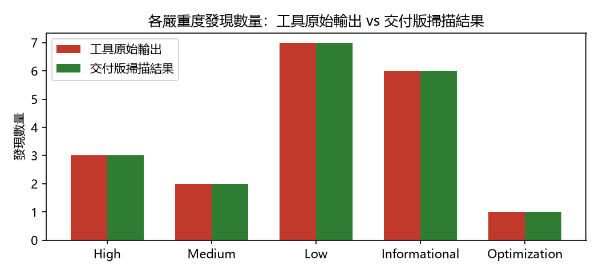

# 智能合約安全檢測報告

**檢測工具**: Slither
**檢測日期**: 2026-07-14T10:39:32.183993

---

**【內部工作版本 — 不可作為交付文件】**

本報告資安等級為：第四級。依交付規範，此狀態僅供工程團隊追蹤修復與確認進度；請於完成處理後重新掃描並產出第一級或第二級報告，方可交付甲方。

---

## 1. 摘要結論

**本案資安等級：第四級**（各等級之定義與判定條件見「附錄二：發現分類與資安等級評定標準」）

偵測到 3 項高嚴重度掃描發現尚未排除（非誤報）、2 項人工複核判定之危急／高風險，需修復並重新掃描後才可交付。

掃描工具原始輸出共 19 項；交付版掃描結果為 19 項（此為甲方以相同工具版本重新掃描交付程式碼時可重現的數字，兩者差異之逐筆理由見「完整分類明細」）。另有 4 筆由人工複核提出、非掃描工具產出的發現（見「人工複核發現」章節）。

> 註：本次「工具原始輸出」與「交付版掃描結果」完全相同 —— 代表未加入任何抑制註解（Step 3 尚未執行，或本案沒有需要標註的 B/C 類項目），並非比對失敗。各項目的實際處理狀態見「完整分類明細」。

---

## 2. 檢測方法與範圍限制

本報告由 Slither 靜態分析工具掃描產生，並經工程團隊逐筆人工分類複核。解讀本報告時，請留意以下範圍限制：

- **偵測範圍**：靜態分析擅長偵測「程式寫法特徵層級」的問題（如重入模式、`tx.origin` 授權、弱亂數來源、未檢查的低階呼叫回傳值等）。
- **已知偵測邊界**：業務邏輯層級的問題 —— 例如權限檢查的實作邏輯錯誤、應存在而未實作的保護、經濟模型層面的攻擊（搶跑、滑點）—— 不在靜態分析工具的可偵測範圍內。本報告的「人工複核發現」章節記錄工程團隊在分類複核過程中以人工方式補充發現的此類問題，但人工複核的覆蓋程度不等同於系統性審計。
- **文件性質**：本報告為交付前之**自我檢查證明**，證明工程團隊已執行掃描並對每一筆發現完成逐筆判讀；其不構成、亦不取代由獨立第三方執行之完整安全審計。

---

## 3. 掃描環境資訊

| 項目 | 內容 |
|---|---|
| 掃描時間 | 2026-07-14T10:39:32.183993 |
| 專案路徑 | /home/kai/security-scan-kit/test-fixtures/vulnerable-vault |
| Git commit | 4eeef1e077b74137cc280cec07123b9a7a2a1ad0 |
| Solidity / solc 版本 | unknown |
| Slither 版本 | 0.11.5 |
| Foundry (forge) 版本 | forge Version: 1.3.5-stable |

---

## 4. 摘要統計

「工具原始輸出」為 Slither 掃描的未經處理結果；「交付版掃描結果」為對含抑制註解之交付版程式碼重新掃描的結果 —— **亦即甲方使用相同版本 Slither（見「掃描環境資訊」）對交付程式碼自行掃描時，可重現的數字**。兩者的差異全部來自經人工分類為 B（可接受風險）或 C（誤報）並加上抑制註解的項目，逐筆理由與註解位置見「完整分類明細」。

嚴重程度沿用掃描工具原文的五個等級：High、Medium、Low、Informational、Optimization。

| 嚴重程度 | 工具原始輸出 | 交付版掃描結果 | 差異 |
|---|---|---|---|
| High | 3 | 3 | +0 |
| Medium | 2 | 2 | +0 |
| Low | 7 | 7 | +0 |
| Informational | 6 | 6 | +0 |
| Optimization | 1 | 1 | +0 |
| **總計** | **19** | **19** | **+0** |

---

## 5. 掃描結果對照圖表

---

## 6. 人工複核發現

以下項目由工程團隊在逐筆分類複核過程中以人工方式發現，**不在掃描工具的輸出之列**（多屬靜態分析無法偵測的邏輯層級問題，見「檢測方法與範圍限制」）。各筆開頭的「編號 M1、M2…」為人工複核發現之流水號：

- **編號 M1｜onlyOwner modifier 的權限檢查恆為真**（嚴重度：Critical／分類 A／情境 L1）— src/VulnerableVault.sol:32-35
  - 說明：require(msg.sender == owner || true) 恆為真，onlyOwner 形同虛設 —— emergencyWithdraw()/topUpRewardPool()/batchPay() 實際上任何人皆可呼叫
  - 備註：人工複核發現（VULNERABILITY_CATALOG.md V3，Slither 漏報）：權限檢查實作邏輯錯誤，屬語意層級問題，靜態分析無對應 detector，需修復。

- **編號 M2｜creditBonus() 完全沒有存取控制**（嚴重度：Critical／分類 A／情境 L2）— src/VulnerableVault.sol:103-107
  - 說明：任何人可呼叫 creditBonus() 幫任意地址無限加值 balances，再透過 withdraw() 提走合約內全部資金
  - 備註：人工複核發現（VULNERABILITY_CATALOG.md V6，Slither 漏報）：應受保護的函式完全缺少存取控制，工具無「此函式該保護而未保護」的判斷能力，需修復。

- **編號 M3｜swap() 無滑點保護與 deadline**（嚴重度：Medium／分類 A／情境 L4）— src/VulnerableVault.sol:125-130
  - 說明：依 oracle 即時報價成交，無 minTokenOut/deadline 參數，可被搶跑（front-run）
  - 備註：人工複核發現（VULNERABILITY_CATALOG.md V8，Slither 漏報）：經濟層級攻擊面，純商業邏輯問題，需修復。

- **編號 M4｜paused 旗標未被任何函式檢查**（嚴重度：Medium／分類 A／情境 L3）— src/VulnerableVault.sol:20
  - 說明：adminSetPaused() 會寫入 paused，但 deposit()/withdraw()/safeWithdraw()/swap() 皆未檢查該旗標，暫停機制形同裝飾，事故應變時無法實際凍結資金流
  - 備註：人工複核發現（不在 VULNERABILITY_CATALOG.md 原始漏洞地圖中，為分類複核時的新發現）：業務邏輯缺陷，需修復並補進漏洞地圖。

---

## 7. 完整分類明細

以下依處置分類逐筆列出本次掃描的全部發現。各筆開頭的「編號 N」為掃描發現之流水號（依掃描輸出順序編定，與「附錄一：待人工確認清單」的編號一致，便於對照）；無該類項目時以「—」表示。

### A. 已確認漏洞，需修復

- **編號 1｜weak-prng**（嚴重度：High）— src/VulnerableVault.sol:90-100
  - 原始描述：VulnerableVault.pickWinner() (src/VulnerableVault.sol#90-100) uses a weak PRNG: "rand = uint256(keccak256(bytes)(abi.encodePacked(block.timestamp,block.prevrandao))) % depositors.length (src/VulnerableVault.sol#92-94)"
  - 備註：真實漏洞（見 VULNERABILITY_CATALOG.md V5）：得獎者可被驗證者/礦工操縱，需修復，不可忽略。

- **編號 2｜reentrancy-eth**（嚴重度：High）— src/VulnerableVault.sol:48-56
  - 原始描述：Reentrancy in VulnerableVault.withdraw() (src/VulnerableVault.sol#48-56): External calls: - (ok,None) = msg.sender.call{value: amount}() (src/VulnerableVault.sol#51) State variables written after the call(s): - balances[msg.sender] = 0 (src/VulnerableVault.sol#53) VulnerableVault.balances (src/VulnerableVault.sol#16) can be used in cross function reentrancies: - VulnerableVault.balances (src/VulnerableVault.sol#16) - VulnerableVault.creditBonus(address,uint256) (src/VulnerableVault.sol#103-107) - VulnerableVault.deposit() (src/VulnerableVault.sol#37-45) - VulnerableVault.safeWithdraw() (src/VulnerableVault.sol#60-68) - VulnerableVault.swap(uint256,IRateOracle) (src/VulnerableVault.sol#125-130) - VulnerableVault.withdraw() (src/VulnerableVault.sol#48-56)
  - 備註：真實漏洞（見 VULNERABILITY_CATALOG.md V1）：經典重入攻擊，可被惡意合約清空金庫，需修復，不可忽略。

- **編號 3｜suicidal**（嚴重度：High）— src/VulnerableVault.sol:85-87
  - 原始描述：VulnerableVault.shutdown() (src/VulnerableVault.sol#85-87) allows anyone to destruct the contract
  - 備註：真實漏洞（見 VULNERABILITY_CATALOG.md V2）：任何人皆可自毀合約，需修復，不可忽略。

- **編號 4｜tx-origin**（嚴重度：Medium）— src/VulnerableVault.sol:79-82
  - 原始描述：VulnerableVault.adminSetPaused(bool) (src/VulnerableVault.sol#79-82) uses tx.origin for authorization: require(bool,string)(tx.origin == owner,not owner) (src/VulnerableVault.sol#80)
  - 備註：真實漏洞（見 VULNERABILITY_CATALOG.md V4）：可被釣魚合約繞過權限檢查，需修復，不可忽略。

- **編號 5｜unchecked-lowlevel**（嚴重度：Medium）— src/VulnerableVault.sol:117-121
  - 原始描述：VulnerableVault.batchPay(address[],uint256) (src/VulnerableVault.sol#117-121) ignores return value by recipients[i].call{value: amountEach}() (src/VulnerableVault.sol#119)
  - 備註：真實漏洞（見 VULNERABILITY_CATALOG.md V7）：轉帳失敗會被靜默吞掉，帳務與實際資金不一致，需修復，不可忽略。

- **編號 8｜calls-loop**（嚴重度：Low）— src/VulnerableVault.sol:117-121
  - 原始描述：VulnerableVault.batchPay(address[],uint256) (src/VulnerableVault.sol#117-121) has external calls inside a loop: recipients[i].call{value: amountEach}() (src/VulnerableVault.sol#119)
  - 備註：與 #5 同一根因（見 VULNERABILITY_CATALOG.md V7），同一批修復。

- **編號 9｜reentrancy-benign**（嚴重度：Low）— src/VulnerableVault.sol:48-56
  - 原始描述：Reentrancy in VulnerableVault.withdraw() (src/VulnerableVault.sol#48-56): External calls: - (ok,None) = msg.sender.call{value: amount}() (src/VulnerableVault.sol#51) State variables written after the call(s): - totalDeposits -= amount (src/VulnerableVault.sol#54)
  - 備註：與 #2 同一根因（V1 的重複偵測），一併修復即可解決。

- **編號 10｜reentrancy-events**（嚴重度：Low）— src/VulnerableVault.sol:90-100
  - 原始描述：Reentrancy in VulnerableVault.pickWinner() (src/VulnerableVault.sol#90-100): External calls: - (ok,None) = winner.call{value: prize}() (src/VulnerableVault.sol#98) Event emitted after the call(s): - WinnerPicked(winner,prize) (src/VulnerableVault.sol#99)
  - 備註：pickWinner() 已因 #1（weak-prng）被判定為真實漏洞函式，此處事件順序問題一併留待修復時處理。

- **編號 12｜reentrancy-events**（嚴重度：Low）— src/VulnerableVault.sol:48-56
  - 原始描述：Reentrancy in VulnerableVault.withdraw() (src/VulnerableVault.sol#48-56): External calls: - (ok,None) = msg.sender.call{value: amount}() (src/VulnerableVault.sol#51) Event emitted after the call(s): - Withdrawn(msg.sender,amount) (src/VulnerableVault.sol#55)
  - 備註：與 #2 同一根因（V1 的重複偵測）。

### B. 已知風險但可接受

- **編號 6｜events-maths**（嚴重度：Low）— src/VulnerableVault.sol:110-114
  - 原始描述：VulnerableVault.topUpRewardPool(uint256) (src/VulnerableVault.sol#110-114) should emit an event for: - rewardPool += amount (src/VulnerableVault.sol#112)
  - 備註（已加上抑制註解）：只影響鏈下可觀測性，不影響資金安全；僅 onlyOwner 可呼叫，屬已知可接受風險，非本次測試刻意植入的漏洞項目。

### C. 可直接忽略（誤報）

- **編號 11｜reentrancy-events**（嚴重度：Low）— src/VulnerableVault.sol:60-68
  - 原始描述：Reentrancy in VulnerableVault.safeWithdraw() (src/VulnerableVault.sol#60-68): External calls: - (ok,None) = msg.sender.call{value: amount}() (src/VulnerableVault.sol#65) Event emitted after the call(s): - Withdrawn(msg.sender,amount) (src/VulnerableVault.sol#67)
  - 備註（已加上抑制註解）：已確認為誤報：safeWithdraw() 採用正確的 checks-effects-interactions 順序（balances 在外部呼叫前歸零），reentrancy-events 只檢查事件在外部呼叫之後才 emit，不代表狀態層級可被重入利用。此為本次測試刻意設計的『安全對照組』函式，用來驗證工具是否會誤判安全程式碼——結果：沒有被 reentrancy-eth/reentrancy-benign 誤判，僅這個最低權重的事件排序 detector 命中，判定為誤報。

- **編號 13｜low-level-calls**（嚴重度：Informational）— src/VulnerableVault.sol:48-56
  - 原始描述：Low level call in VulnerableVault.withdraw() (src/VulnerableVault.sol#48-56): - (ok,None) = msg.sender.call{value: amount}() (src/VulnerableVault.sol#51)
  - 備註（已加上抑制註解）：純資訊性提示（單純標註有低階呼叫），不構成獨立風險判斷，實際風險已由 #2 追蹤。

- **編號 14｜low-level-calls**（嚴重度：Informational）— src/VulnerableVault.sol:90-100
  - 原始描述：Low level call in VulnerableVault.pickWinner() (src/VulnerableVault.sol#90-100): - (ok,None) = winner.call{value: prize}() (src/VulnerableVault.sol#98)
  - 備註（已加上抑制註解）：同上，純資訊性提示，實際風險已由 #1 追蹤。

- **編號 15｜low-level-calls**（嚴重度：Informational）— src/VulnerableVault.sol:117-121
  - 原始描述：Low level call in VulnerableVault.batchPay(address[],uint256) (src/VulnerableVault.sol#117-121): - recipients[i].call{value: amountEach}() (src/VulnerableVault.sol#119)
  - 備註（已加上抑制註解）：同上，純資訊性提示，實際風險已由 #5/#8 追蹤。

- **編號 16｜low-level-calls**（嚴重度：Informational）— src/VulnerableVault.sol:60-68
  - 原始描述：Low level call in VulnerableVault.safeWithdraw() (src/VulnerableVault.sol#60-68): - (ok,None) = msg.sender.call{value: amount}() (src/VulnerableVault.sol#65)
  - 備註（已加上抑制註解）：同上，純資訊性提示；safeWithdraw() 本身已確認安全（見 #11）。

- **編號 17｜naming-convention**（嚴重度：Informational）— src/VulnerableVault.sol:79
  - 原始描述：Parameter VulnerableVault.adminSetPaused(bool)._paused (src/VulnerableVault.sol#79) is not in mixedCase
  - 備註（已加上抑制註解）：純命名風格建議，非安全問題。

- **編號 18｜reentrancy-unlimited-gas**（嚴重度：Informational）— src/VulnerableVault.sol:72-76
  - 原始描述：Reentrancy in VulnerableVault.emergencyWithdraw(address,uint256) (src/VulnerableVault.sol#72-76): External calls: - to.transfer(amount) (src/VulnerableVault.sol#74) Event emitted after the call(s): - EmergencyWithdrawal(to,amount) (src/VulnerableVault.sol#75)
  - 備註（已加上抑制註解）：純資訊性提示，onlyOwner 才能呼叫，非本次刻意植入的漏洞項目。

- **編號 19｜immutable-states**（嚴重度：Optimization）— src/VulnerableVault.sol:15
  - 原始描述：VulnerableVault.owner (src/VulnerableVault.sol#15) should be immutable
  - 備註（已加上抑制註解）：純 gas 優化建議，非安全問題。

### D. 待人工確認

- **編號 7｜missing-zero-check**（嚴重度：Low）— src/VulnerableVault.sol:72
  - 原始描述：VulnerableVault.emergencyWithdraw(address,uint256).to (src/VulnerableVault.sol#72) lacks a zero-check on : - to.transfer(amount) (src/VulnerableVault.sol#74)
  - 備註：涉及資金流向（轉帳目標地址），依規則歸類 D：雖非本次刻意植入的漏洞編號，但屬真實可改進項目，需人工確認是否修復。

---

## 附錄一：待人工確認清單

| 編號 | 項目 | 嚴重度 | 位置 | 說明 |
|---|---|---|---|---|
| 7 | missing-zero-check | Low | src/VulnerableVault.sol:72 | VulnerableVault.emergencyWithdraw(address,uint256).to (src/VulnerableVault.sol#72) lacks a zero-check on : - to.transfer(amount) (src/VulnerableVault. |

---

## 附錄二：發現分類與資安等級評定標準

本報告的判讀採兩層標準：先對每一筆發現進行**處置分類**（A／B／C／D），再由全部分類結果推導**整案資安等級**（第一級～第四級）。兩者為獨立系統，字母與級數不可互相對照。

**發現處置分類（逐筆判定）**

- **A｜已確認漏洞，需修復**：確認為真實問題（多涉及資金流向或權限控制邏輯），必須修復；不得以註解抑制，抑制等同隱匿。
- **B｜已知風險但可接受**：問題確實存在，但經工程團隊評估風險可控（例如僅管理者可呼叫、另有其他層級防護），附具體理由後可加註解抑制，並於報告揭露。
- **C｜可直接忽略（誤報）**：靜態分析限制造成的誤判，實際已有防護機制；附具體理由後可加註解抑制。
- **D｜待人工確認**：尚無法判定歸屬者一律列此類，不得抑制；判讀信心不足時寧列 D，不猜測分類。
- **人工複核發現**：掃描工具輸出之外、由人工閱讀原始碼發現的問題，僅得分類 A／B／D；經確認非問題者直接自清單移除，不設誤報分類。

**整案資安等級（以下由第一級至第四級列出定義；實際評定則由高至低逐條檢查，符合任一條件即定為該級）**

- **第一級｜可直接交付**：掃描範圍內所有發現均確認為誤報，且無待處理之人工複核發現。
- **第二級｜可交付，需揭露已知風險**：無下列第三、四級情況，但存在 B 類已知風險。
- **第三級｜待確認，不建議交付**：無下列第四級情況，但存在任何 A（已確認未修復）或 D（待確認）項目，或有掃描發現未完成分類（未分類一律視同 D，不視同已解決）。
- **第四級｜不通過**：存在任一「高」嚴重度且非誤報的掃描發現，或任一「危急／高」的人工複核發現。高嚴重度項目不得以「可接受風險」定級 —— 只能修復，或確認為誤報。
- 未提供分類結果時不予評級，報告一律視為內部工作版本。

